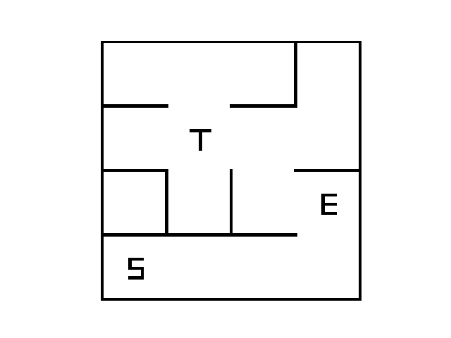

# DUNGEON MAZES

This Python package builds a valid maze generator using deep reinforcement learning (Deep Q-learning).


## Goal
The goal is to build a 4-by-4 Maze generator with existing paths between key points.
There are three key points: "Start", "Exit" and "Treasure" respectively represented by the letter "S", "E" and "T" on the figure below.
A Maze is regarded as valid if there exists a path between points "S" and "E", and between points "S" and "T".
The figure below shows a valid 4-by-4 maze. 




## ML
The maze generator procedure is based on a reinforcement learning strategy called Q-learning. 
  
* As along as a maze is not valid the algorithm (whatever policy it follows) keeps withdraw edges. Once the maze is valid the procedure stops.
* In this implementation, once a maze is initialized only the edge state are changes. The key points do not move to reach maze validity.  
* For a non-valid maze, the value of the Q function (an estimation of the cumulated future rewards) is computed for each remaining edges. 
The edge having the maximum value is picked to be withdrawn.
* The Q function is estimated for each remaining edge with a Deep Neural Network refered as DQN. It is a small network with few fully connected layers.
* We defined a notion of reachable points which helps to qualify maze configurations. Mainly, three groups of reachable groups are of interest: 1. The points reached from the starting point "S", 2. The points reached from the exit point "E", and 3. The points reached from the treasure point "T".
* Edge features are composed of two global distances (i.e. the same for all edges) and three local distances. For the first ones (global): 1. the distance between "S" group and "E" and 2. the distance between the "S" group and "T"). And for the seconds ones (local): the distance between the corresponding edge and the three groups ("S", "E" and "T").


### References:
* https://pytorch.org/tutorials/intermediate/reinforcement_q_learning.html
* https://huggingface.co/learn/deep-rl-course/unit3/deep-q-network?fw=pt


## Installation

Install Docker and MLflow (`pip install mlflow`).  

Then, build the docker image for the training:

```
docker build -t dungeon-maze-generator -f Dockerfile .
```

Run a maze generator training (the parameters inside the script `train_maze_generator.py` should be good enough to deliver a decent maze generator):

```
mlflow run . --experiment-name your-exp-name --build-image
```

This should have created a folder named `mlruns` in your working directory (where you have run the previous line).  
If you want to visualize the few logged metrics and params, feel free to run `mlflow ui` and to go to `localhost:5000`.


## Usage

To use the maze generator through a Python function, run the following code inside your working folder. 
The `run_id` variable can be found either on mlflow user interface or is print in stdout of the training script.

```
import mlflow
logged_model = 'runs:/{run_id}/model'

# Load model as a PyFuncModel.
loaded_model = mlflow.pyfunc.load_model(logged_model)
```


You can run the example script `example_maze_generation.py` to visualize graphical outputs:

```
python dungeon/example_maze_generation.py --run-id run_id
```

As it is not well deployed yet, you should have install the `dungeon` package (`pip install -r requirements.txt && pip install .`) or run the script inside the package (in that cas the `mlruns` should also be there).


## Further improvements

* Stabilty and performance of the learning procedure mainly through finer local features and Q-learning optimization.
* Better handling of parameters using MLflow tools.
* Deployment using Docker container and serve model through web API for better isolation.
* More effient implementation of mazes to speed up example generation and leverage GPU.


